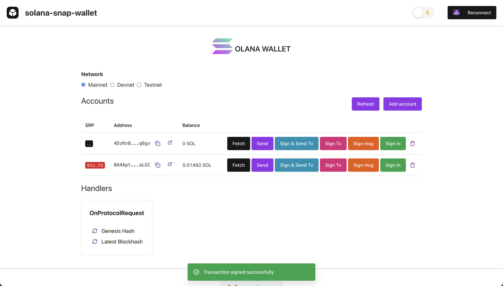

# Solana Wallet Test Dapp

A comprehensive web-based testing interface designed for developers to interact with and validate Metamask's Solana wallet integration. This dapp provides a controlled environment for testing essential wallet operations including:

- Transaction signing and verification
- Transaction broadcasting
- Account management
- Wallet connection and state handling
- Balance checking and token operations

The dapp serves as a development sandbox, enabling thorough testing of Solana-based smart contract interactions and wallet functionality within the Metamask ecosystem.

This project was bootstrapped with [Gatsby](https://www.gatsbyjs.com/).

## Available Scripts

In the project directory, you can run:

### `yarn start`

Runs the app in the development mode.\
Open [http://localhost:3000](http://localhost:3000) to view it in the browser.

The page will reload if you make edits.\
You will also see any lint errors in the console.

### `yarn build`

Builds the app for production to the `public` folder.\
It correctly bundles React in production mode and optimizes the build for the best performance.

The build is minified and the filenames include the hashes.\
Your app is ready to be deployed!

See the section about [deployment](https://www.gatsbyjs.com/docs/how-to/previews-deploys-hosting/) for more information.

## Environment variables

Gatsby has built-in support for loading environment variables into the browser and Functions. Loading environment variables into Node.js requires a small code snippet.

In development, Gatsby will load environment variables from a file named `.env.development`. For builds, it will load from `.env.production`.

By default you can use the `SNAP_ORIGIN` variable (used in `src/config/snap.ts`) to define a production origin for you snap (eg. `npm:MyPackageName`). If not defined it will defaults to `local:http://localhost:8080`.

A `.env` file template is available, to use it rename `.env.production.dist` to `.env.production`

To learn more visit [Gatsby documentation](https://www.gatsbyjs.com/docs/how-to/local-development/environment-variables/)

## Learn More

You can learn more in the [Gatsby documentation](https://www.gatsbyjs.com/docs/).

To learn React, check out the [React documentation](https://reactjs.org/).
